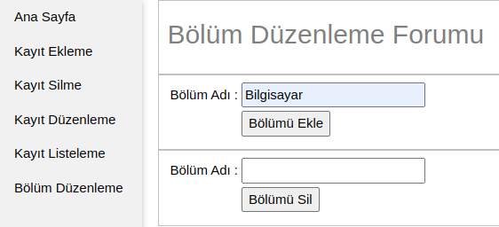
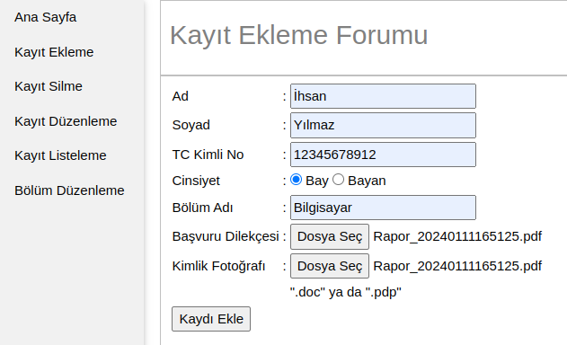
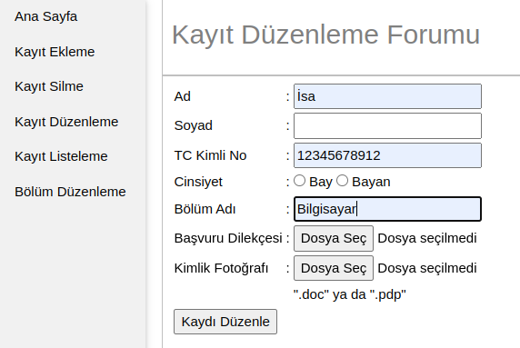
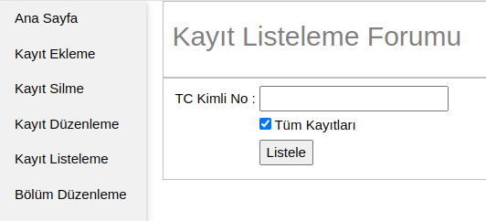
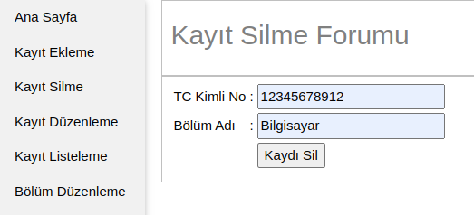

* '**basvuru.sql**' dosyasını kullanarak uygulamaya ait veri tabanını içe aktarabilirsiniz.

* Veri tabanı bağlanma bilgilerini "basvuru/cont-body/uygulama/conn.php" dosyasından değiştirebilirsiniz.

$servername = "localhost";  
$username = "root";  
$password = "";  
$database = "basvuru";

---
### -- Bölüm Düzenleme --

**Çıktı:** "Bilgisayar" adlı bölüm basarıyla eklenmiştir.

**Dosya Yolu:**  
  

---
### -- Kayıt Ekleme --

**Çıktı:** Kayıt başarıyla eklendi.

---
### -- Kayıt Düzenleme --

**Çıktı:** Adı başarıyla güncellendi.

---
### -- Kayıt Listeleme --

**Çıktı:**  

---
### -- Kayıt Silme --

**Çıktı:** "12345678912" TC Kimlik numaralı kayıt başarıyla silinmiştir.

