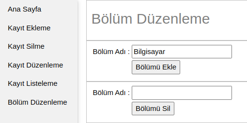
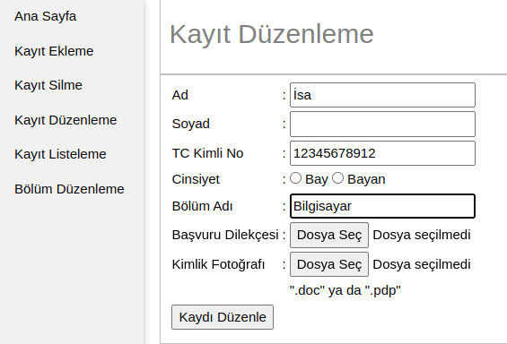
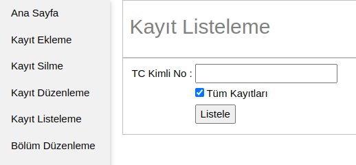
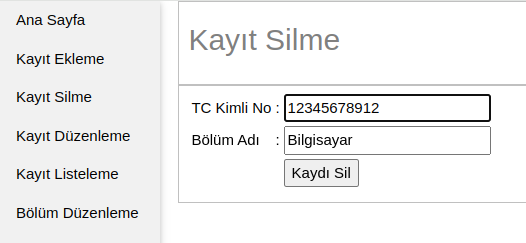

+ '**basvuru.sql**' dosyasını kullanarak uygulamaya ait veri tabanını içeri aktarabilirsiniz.

+ Veri tabanı bağlantı bilgilerini "Basvuru/cont-body/uygulama/conn.php" dosyasından değiştirebilirsiniz.

```php
# conn.php bağlantı bilgileri.
$servername = "localhost";  
$username = "root";  
$password = "";  
$database = "basvuru";
```

---
### Bölüm Düzenleme


**Çıktı:** "Bilgisayar" adlı bölüm basarıyla eklenmiştir.

**Dosya Yolu:**

  

---
### Kayıt Ekleme


**Çıktı:** Kayıt başarıyla eklendi.

---
### Kayıt Düzenleme


**Çıktı:** Adı başarıyla güncellendi.

---
### Kayıt Listeleme


**Çıktı:**


---
### Kayıt Silme


**Çıktı:** "12345678912" TC Kimlik numaralı kayıt başarıyla silinmiştir.